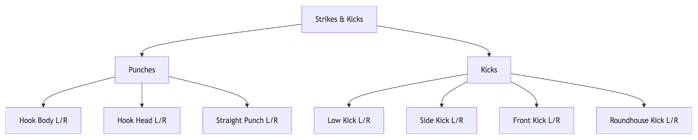

<div style="display: flex; justify-content: space-between; align-items: center;">
  <div>
    
  </div>

  <div>
    
  </div>
</div>

# Thai-Boxing-Assistant

We explored two approaches to recognize diverse strikes/kicks:

- **Dynamic Time Warping (DTW)**: Aligns motion sequences temporally using single reference samples
- **Random Forest (RF)**: Leverages feature engineering and multi-sample training for classification

Using MediaPipe, we extracted 33 body keypoints (x,y,z,visibility) to model movements through both temporal alignment and statistical learning.

<div align="center">
  
</div>

## Key Findings

- **RF outperformed DTW**
- Both models faced challenges generalizing to new users due to technique variations
- DTW's "one reference sample" approach showed limited adaptability compared to RF's learned patterns
- Angle velocities and limb speeds emerged as critical features for RF

## Installation (Windows/macOS)

Python **3.12** is required due to Mediapipe

1. Clone the repository

```bash
git clone https://github.com/mithuGit/Thai-Boxing-Trainer.git
```

Notice: If you’re not already in the ‘Thai-Boxing-Assistant’ folder, navigate there using cd

```bash
cd Thai-Boxing-Assistant/
```

2. Create virtual environment

```bash
python3.12 -m venv .venv
```

3. Activate environment

```bash
# Windows:
.venv\Scripts\activate
# macOS:
source .venv/bin/activate
```

4. Install dependencies

```bash
pip install -r requirements.txt
```

5. Run program (please refer to the specific README for DTW or Random Forest for usage guidelines)

6. If this error occurs:

```bash
from mediapipe.python._framework_bindings import model_ckpt_util
ImportError: DLL load failed while importing _framework_bindings: Eine DLL-Initialisierungsroutine ist
```

Please install this dependency:

```bash
pip install msvc-runtime
```

Note: Test videos for experimenting with the programs can be found in the DTW/test_videos/ directory.

<br>
<br>

<div align="center">
  
</div>

<div align="center">
  <p>Developed by: <strong>Mithusan Naguleswaran</strong>, <strong>Nils Kovacic</strong>, <strong>Ebenhaezer Aubrey Sopacua</strong>, <strong>Tim Duc Minh</strong>, <strong>Maximilian Laue</strong> </p>
</div>

<div align="center">
<p>Special Thanks to our supervisor <strong>Quentin Delfosse</strong> and our external expert <strong>Vincent Scharf</strong> for their valuable insights and support in developing our ideas.</p>
<p>Also thanks to the members of the <strong>Kickboxing Club</strong> at TU Darmstadt, who volunteered to be filmed for our dataset.</p>
</div>
